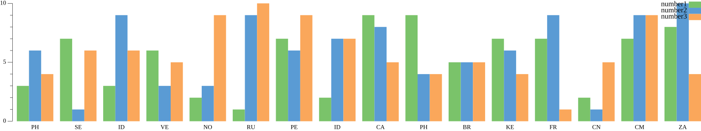

# PIMTrace tools

These are a series of tools that allow the querying, filtering and summarizing
of data on the command line in one-liners. 

Current supported formats:
* ICal
* Mbox
* Mail file
* CSV

More might be coming.

This is a work in progress (I need it for something else) however I will develop
it to meet my itches. I am happy to accept PRs of reasonable addition and changes.
I am a "batteries included" person so additions are appreciated.

## Uses?

* Filtering and sorting CSV files
* Querying ical and mail files for specific or statistical information

# Usage

Currently, there are 3 main tools provided by this:
* `icaltrace` - for ical. This was thrown in quickly
* `mailtrace` - For mailfiles and mbox files at the moment
* `csvtrace` - For tabular data, namely CSV files

# Query Language

## Basic

There are a couple of things you can do:
* Filter out entries
* Sort the entries
* Output it in
  * The original format
  * A new format, such as
    * Tabular (csv)
* Group by columns
* Convert columns using a function

The ways you do it are with the following constructs:
* `sort ...`
* `filter ...` <-- Filters out rows
* `into table ...` <-- Converts to tabular data and/or filters out columns and/or transforms columns using functions 
* `into summary ...` <-- All of `into table` but must also group records

See the syntax section for a better guide but works mostly as you would expect from a SQL like query such as:
* `sort h.numberrange`
* `filter h.numberrange eq .1`
* `into table h.numberrange f.year[h.date] f.month[h.date]`
* `into summary h.numberrange calculate f.count`

You can repeat elements for interesting effects:
```
filter h.email icontains .gmail into summary h.numberrange calculate f.count filter c.count eq .1
```
Which is similar to the sql `HAVING` after a `GROUP BY`

### Syntax

The query language supports any combination of the following "syntax".

Roots:
* `sort` ` ` expressions...
* `filter` ` ` boolean-expressions...
* `into` ` ` `table` ` ` expressions...
* `into` ` ` `summary` ` ` expressions... ` ` `calculate` expressions...

Boolean-expressions:
* boolean-expression
* boolean-expression ` ` boolean-expressions

Boolean-expression:
* `not` ` ` Boolean-expression
* expression `eq` expression
* expression `contains` expression
* expression `icontains` expression

Expression:
* `f.` functionname 
* `func.` functionname 
* `f.` functionname `[` function-arguments... `]`
* `func.` functionname `[` function-arguments... `]`
* `h.` headername
* `header.` headername
* `p.` propertyname
* `property.` propertyname
* `c.` columnname
* `column.` columnname
* string

headername:
* TEXT

functionname:
* TEXT

propertyname:
* TEXT

string:
* `.` TEXT

## Notes:
* Certain "expressions" are only available for certain data types:
  * `column` CSV, table, group, data
  * `header` Mail
  * `property` ICal

More is definitely required, in most cases it shouldn't be too hard to add. That or create an issue, or if it's too hard
tell me why in an issue / discussion.

## Examples:

```
GolandProjects/pimtrace 1698 % go run ./cmd/csvtrace -input ast/testdata/data10.csv -input-type=csv -output-type table -parser basic 
+-------------------+----------------+----------------------------------+------------------------------+----------+-------------+
|       NAME        |     PHONE      |              EMAIL               |           ADDRESS            | CURRENCY | NUMBERRANGE |
+-------------------+----------------+----------------------------------+------------------------------+----------+-------------+
| Jasper Joseph     | (125) 832-4826 | mauris.vestibulum@protonmail.edu | Ap #783-8034 Nunc Street     | $73.44   |           4 |
| Rogan Hopkins     | 1-764-710-2172 | dolor.fusce.mi@protonmail.couk   | Ap #758-5121 Suspendisse Ave | $70.93   |           9 |
| Shay Cleveland    | (637) 964-7108 | lorem@icloud.net                 | 456-1057 Libero. St.         | $7.62    |           9 |
| Maite Weaver      | (739) 463-1949 | adipiscing.mauris@hotmail.net    | Ap #255-7815 Erat Avenue     | $32.88   |           7 |
| Adria Herring     | (337) 415-5957 | integer.eu@yahoo.com             | Ap #669-2053 Amet St.        | $13.79   |           6 |
| Laurel Gonzalez   | (895) 846-2962 | porttitor.vulputate@google.org   | Ap #767-7502 In, Road        | $98.11   |           9 |
| Jane Bender       | 1-659-923-1774 | duis.gravida@protonmail.couk     | 618-8403 Aliquam Av.         | $40.56   |           9 |
| Melinda Barton    | 1-576-782-5035 | donec@aol.ca                     | 878-2869 Purus. Av.          | $63.92   |           9 |
| Colorado Sandoval | (737) 534-1143 | vel.vulputate@aol.net            | 8766 Nonummy St.             | $82.73   |           9 |
| Felix Sutton      | (915) 275-7510 | justo.faucibus@hotmail.com       | 978-3821 Odio. Rd.           | $30.35   |           1 |
+-------------------+----------------+----------------------------------+------------------------------+----------+-------------+
GolandProjects/pimtrace 1699 % go run ./cmd/csvtrace -input ast/testdata/data10.csv -input-type=csv -output-type table -parser basic filter h.numberrange eq .1
+--------------+----------------+----------------------------+--------------------+----------+-------------+
|     NAME     |     PHONE      |           EMAIL            |      ADDRESS       | CURRENCY | NUMBERRANGE |
+--------------+----------------+----------------------------+--------------------+----------+-------------+
| Felix Sutton | (915) 275-7510 | justo.faucibus@hotmail.com | 978-3821 Odio. Rd. | $30.35   |           1 |
+--------------+----------------+----------------------------+--------------------+----------+-------------+
GolandProjects/pimtrace 1700 % go run ./cmd/csvtrace -input ast/testdata/data10.csv -input-type=csv -output-type table -parser basic into summary h.numberrange calculate f.count
+-------------+-------+
| NUMBERRANGE | COUNT |
+-------------+-------+
|           4 |     1 |
|           9 |     6 |
|           7 |     1 |
|           6 |     1 |
|           1 |     1 |
+-------------+-------+

```

# Output types

## Tabular: CSV and Table

Most input formats can be converted to CSV and Table with different conditions

## Plot

Any tabular data can be converted into a bar provided the format is correct.

### Bar

The data:
```csv
country,number1,number2,number3
PH,3,6,4
SE,7,1,6
```

Can be converted into a plot like:



Given the following input:
```bash
% go run ./cmd/csvtrace -input ast/testdata/countrynums.csv -input-type csv -output barplot.png -output-type plot.bar -parser=basic
```

With this output type you ***must*** specify an output filename and the first column must be 
a string, and all subsequent columns must contain a number on each row.

# FAQ

## Why

I needed this, I wanted to make one tool oneliners easier and more "query" like. 
However, not so much you have to pass it as a string or use a lot of "escape" codes.

## `*Trace`?

It's an illusion towards `dtrace` although it's not quite the same thing, it was
chosen for uniqueness.

## Will you be developing it more

I would like to. Maybe?

## Future data formats

I would like to include other formats such as:
* JSONLines
* JSON / YAML (using jsonpath to denote different entities)
* TSV
* "Mail dir" format - Directory walking
* Archived and compressed files
* PST files

etc.

## Basic parser

I know it's a bit more than a basic parser however I was hoping to make the syntax
more complex with an LR parser however I didn't get around to it. I was hoping
to expand on the concept of "args" as tokens, and do more sub-arg tokenization.

I am requiring the use of `-parser basic` so that future scripts don't get broken.
As a "least I could do" approach.
